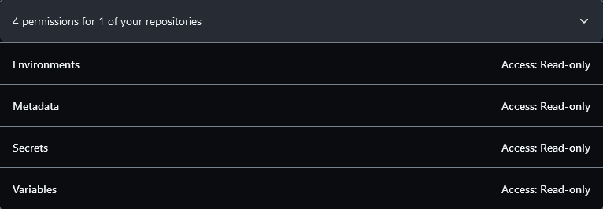

# validate-secrets-action

Validate variables and secrets inside github actions workflows using the Github API.

The action can check repository secrets/vars, environment secrets/vars and organization secrets/vars given the right permissions on the GH Token.

## Usage/Examples

For this to work, you must create a token with the following permissions:


To enable organization level checks, you must also give the token access to read organization level secrets

The action will be marked as failed if any of the secrets or vars in the files being checked is missing.

```yml
on: [push]

jobs:
  hello_world_job:
    runs-on: ubuntu-latest
    name: Validate secrets in the repository
    steps:
      - name: Checkout
        uses: actions/checkout@v4

      - name: Install npm package
        run: npm install

      - name: Test the action
        id: test
        uses: ./
        with:
          files: |-
            test.yaml
          gh_token: ${{ secrets.SECRET_VALIDATION_TOKEN }}
          verbose: "true"

      - name: Test secret exists
        run: echo ${{ secrets.TEST_SECRET }}

      - name: Test secret does not exist
        run: echo ${{ secrets.TEST_SECRET_2 }}

      - name: Test var exists
        run: echo ${{ vars.TEST_VAR }}

      - name: Test var does not exist
        run: echo ${{ vars.TEST_VAR_2 }}
```
